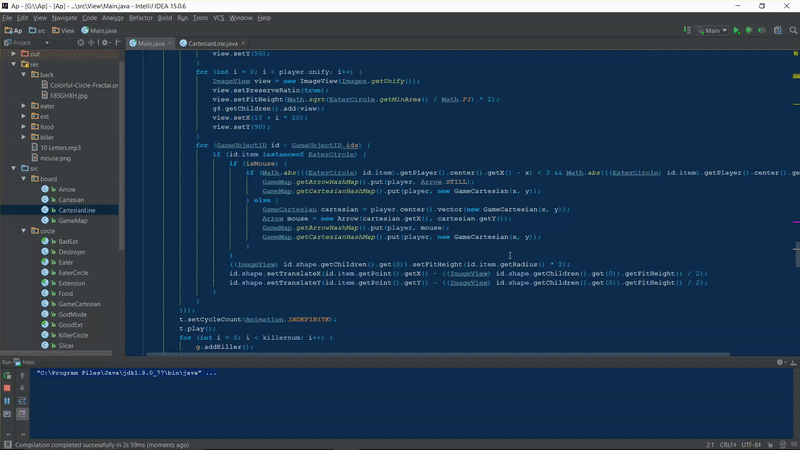
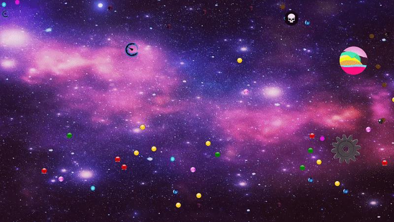

# Mini Agar.io game in Java
this is a mini Agar.io game in Java that is graphiced with JavaFX.
## How to run?
Just run View/Main.java file. And go as you can see in Gif one.
## How to play?
If you are familiar with agar.io, you should know almost all of it. Then know that in this code, clicking will halve all you circles (which is showed on the third Gif) and... These Gifs will show you the rest.
## Gifs:
#### one: start

#### two: death

#### three: halving

#### four: saw

#### five: absorb

## Author

* **Peyman Mohseni kiasari**

## License

This project is licensed under the MIT License - see the [LICENSE.md](LICENSE.md) file for details